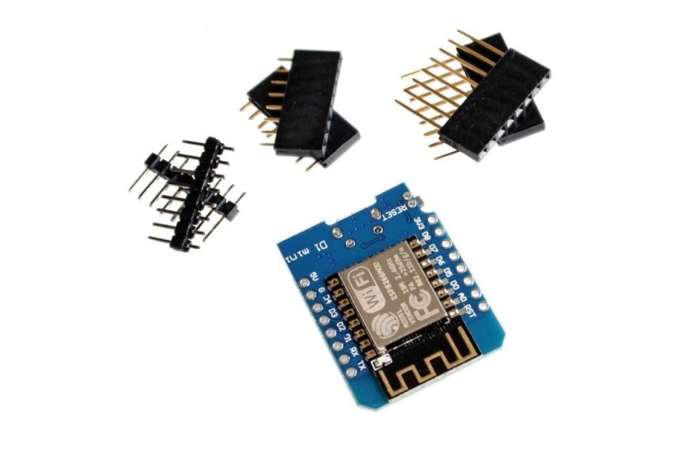
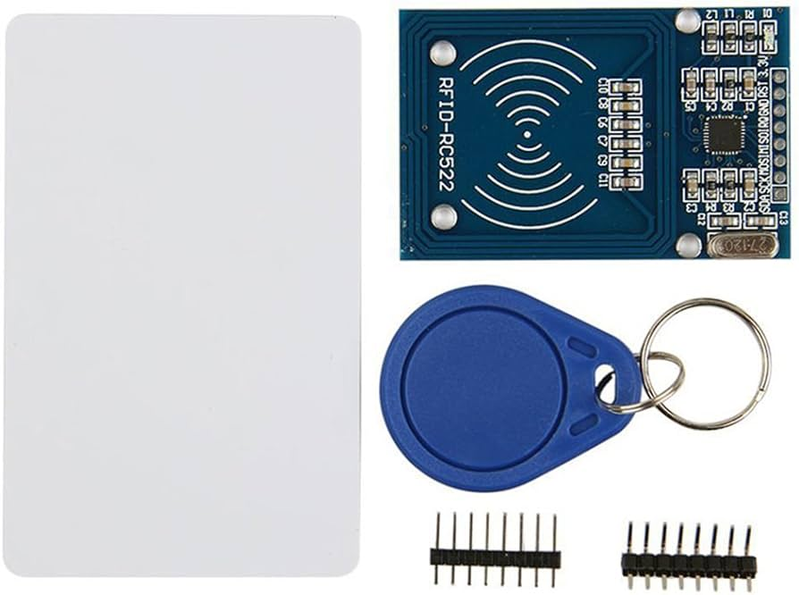
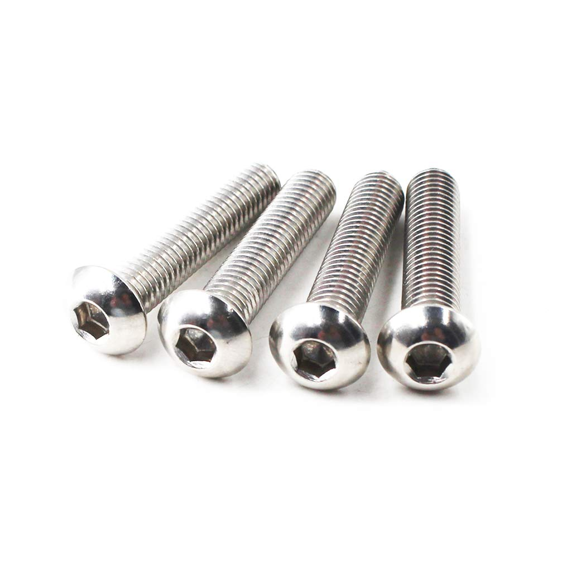
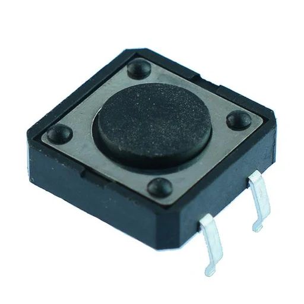
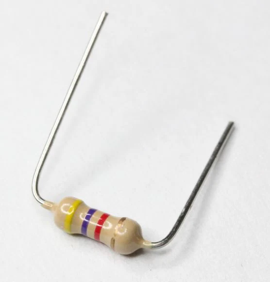

# Spoolman NFC Thingy (Beta)

### Attention!
This is an ongoing project. Currently this page is designed to only provide a basic description and part list. After the initial testing is finished by the early adopters, it will be significantly extended.

### Prerequisites
#### Mandatory
1. 3D printer with Klipper firmware (should be accessible via 2.4Ghz WIFI network)
2. ~70g of filament
3. Soldering iron, solder, basic soldering skills 

#### Optional, but highly recommended
1. Sharp tweezers
2. Multimeter

### Parts list
> Please note that this device is designed to be as cheap as possible. All parts selected to be easily aquired in any part of the world for a fair price. Unfortunately many stores like to be dishonest with their markups so please use the included approximate price to make sure you're not overpaying tenfold. In most cases every item can be purchased both locally or through Aliexpress (fast vs cheaper).

1. WEMOS D1 Mini Lite (or clone; USB-C or MicroUSB) $3
2. USB-C or MicroUSB cable (with data lines to upload firmware; any kind to power the device)
3. RFID RC522 $2
4. 1m of UTP/FTP ethernet cable $1
5. 5mm RGB led (common cathode) $0.2
6. 12x12x4.3mm momentart pushbutton switch $0.1
7. Five M3x8 button hat screws $0.5
8. 13.54Mhz NFC stickers (NTAG203, NTAG213, NTAG214 etc). In theory any 13.54Mhz should work $0.1-0.2 per piece
9. 1-10k resistor (4.7k for perfection)

#### Here are some pictures for refence purposes
> Please compare your purchases to these photos to make sure you're getting the right thing
> Also note that Wemos and RC522 should be sold as a kit (as displayed below)

